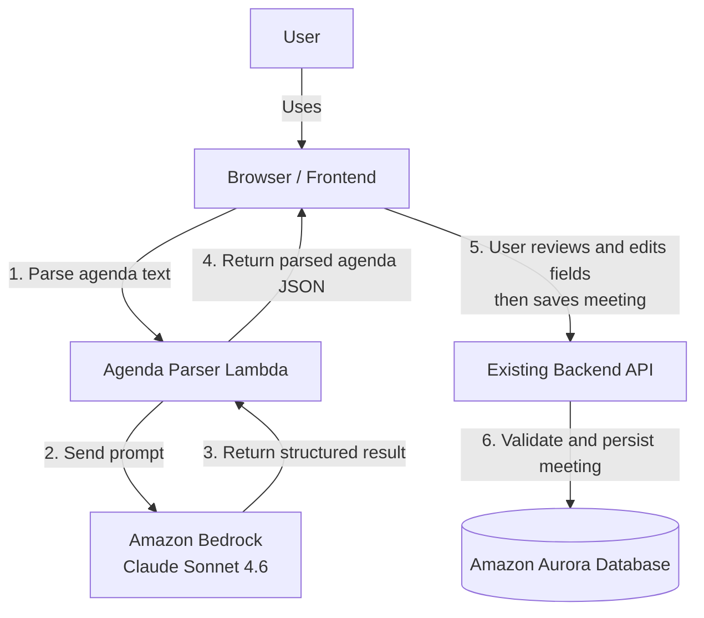

# C4 Container Diagram – LLM Agenda Parsing

```mermaid
flowchart TB
    User["User"]
    Browser["Browser / Frontend"]

    Parser["Agenda Parser Lambda"]
    Bedrock["Amazon Bedrock<br/>Claude Sonnet 4.6"]

    API["Existing Backend API"]
    Aurora[("Amazon Aurora Database")]

    User -->|"Uses"| Browser

    Browser -->|"1. Parse agenda text"| Parser
    Parser -->|"2. Send prompt"| Bedrock
    Bedrock -->|"3. Return structured result"| Parser
    Parser -->|"4. Return parsed agenda JSON"| Browser

    Browser -->|"5. User reviews and edits fields<br/>then saves meeting"| API
    API -->|"6. Validate and persist meeting"| Aurora
```
